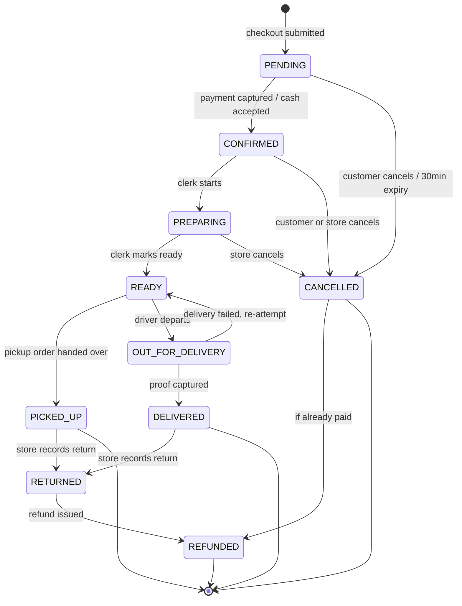
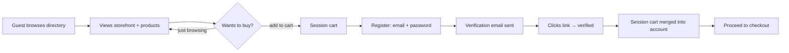
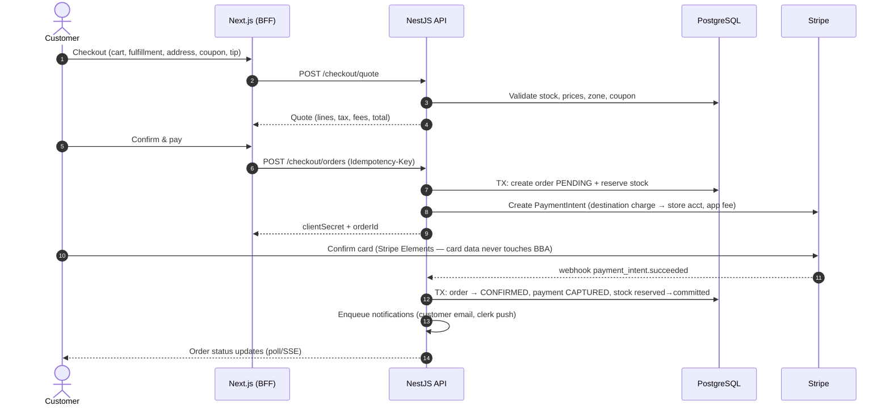
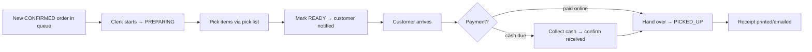
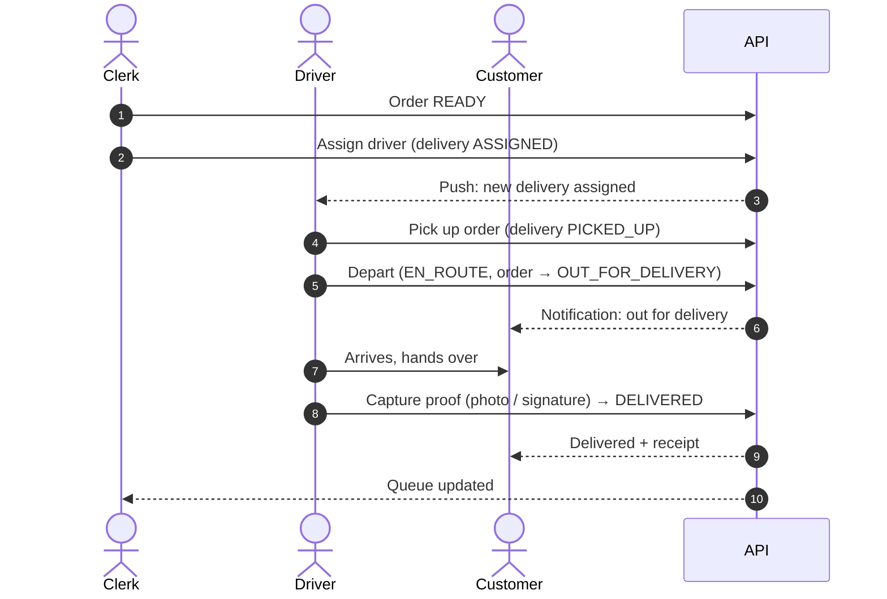
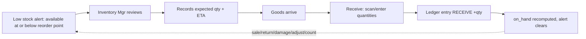
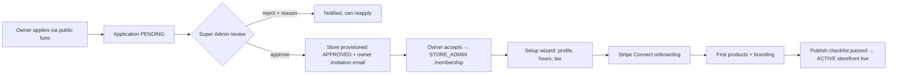
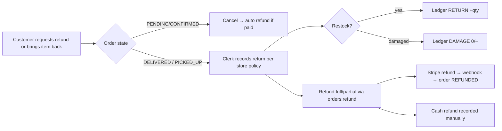

# 5. User Journeys & Workflow Diagrams

The six journeys marked ★ are the critical paths covered by E2E tests (NFR-MNT-03).

## 5.1 Order state machine (the platform's backbone)

Direct evolution of BBA3's RetailThread. Statuses per FR-ORD-01; every transition is validated server-side and recorded in `order_status_history`.

### Transition permissions

| Transition | Allowed actor |
|------------|--------------|
| PENDING → CONFIRMED | System (Stripe webhook) for card; CLERK/STORE_ADMIN for cash orders |
| PENDING/CONFIRMED → CANCELLED | Customer (own order), CLERK, STORE_ADMIN, system (expiry) |
| CONFIRMED → PREPARING → READY | CLERK, STORE_ADMIN |
| READY → PICKED_UP | CLERK, STORE_ADMIN |
| READY → OUT_FOR_DELIVERY | DELIVERY (own assignment) — auto on driver "depart" |
| OUT_FOR_DELIVERY → DELIVERED | DELIVERY (own, requires proof) |
| PREPARING → CANCELLED | STORE_ADMIN, CLERK (customer may *request*) |
| → RETURNED | CLERK, STORE_ADMIN |
| → REFUNDED | Holder of `orders:refund`; system on Stripe refund webhook |

## 5.2 ★ Guest → Customer registration

Notes: registration never blocks browsing; cart merge is by (store, variant) with quantity sum; unverified users are stopped at checkout, not at cart.

## 5.3 ★ Checkout & payment (card)

Failure paths: payment fails → order stays PENDING, retry allowed; 30 min expiry cancels and releases stock (FR-ORD-09). Cash checkout skips Stripe: order goes PENDING with `payment=CASH_DUE`, clerk confirms → CONFIRMED, cash marked received at handover by staff with `payments:collect-cash` (BBA3 receiver flow, now role-based).

## 5.4 ★ Fulfillment — pickup (Clerk)

## 5.5 ★ Fulfillment — delivery (Clerk + Driver)

Failed delivery: driver submits FAILED + reason → order back to READY, store notified, re-attempt or customer contact (FR-DLV-05).

## 5.6 ★ Inventory receiving & low stock loop

Every arrow into the ledger is append-only; on-hand is derived, never hand-edited (FR-INV-02/04).

## 5.7 ★ Store onboarding (Super Admin + Owner)

Target: approval → live in under one day (§1.6). The publish checklist blocks going live without: ≥1 active product, payment method enabled, hours set, contact info.

## 5.8 Refund / return

## 5.9 Notification touchpoints summary

| Event | Customer | Clerk | Inv. Mgr | Driver | Store Admin | Super Admin |
|---|---|---|---|---|---|---|
| order.placed | email+in-app | push+in-app | — | — | in-app | — |
| order.status_changed | email (READY, OUT_FOR_DELIVERY, DELIVERED) + in-app | in-app | — | — | — | — |
| order.cancel_requested | in-app | push | — | — | in-app | — |
| delivery.assigned | — | in-app | — | push | — | — |
| inventory.low_stock | — | — | push+email | — | in-app | — |
| payment.failed / dispute | email | — | — | — | email+in-app | in-app |
| review.submitted | — | — | — | — | in-app | — |
| store.approved / suspended | — | — | — | — | email | in-app |
| subscription.payment_failed | — | — | — | — | email | in-app |
