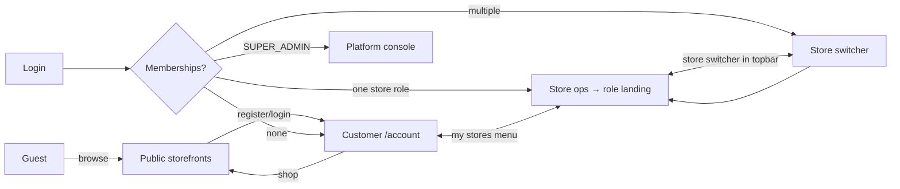

# 6. Information Architecture

One responsive Next.js app, four surfaces. Staff pages live under a single ops area whose navigation is **permission-gated** (a driver sees only Deliveries; a clerk sees Orders/POS/Customers) — one codebase, no per-role route duplication.

## 6.1 URL map

```
PUBLIC (SEO, guest-accessible)
/                                   Platform home: store directory + search
/stores                             Directory search/filter (area, type)
/stores/[slug]                      Storefront landing (store-branded, 3 layouts)
/stores/[slug]/products             Product listing + filters
/stores/[slug]/products/[pslug]     Product detail
/stores/[slug]/about                Hours, address, map, contact, policies
/stores/[slug]/cart                 Cart (per store)
/stores/[slug]/checkout             Checkout (auth required)
/stores/[slug]/checkout/confirm     Order confirmation
/apply                              Store owner application
/signin  /signup  /verify-email  /forgot-password  /reset-password
/invite/[token]                     Staff/owner invitation acceptance

CUSTOMER  (/account/*)
/account                            Overview: recent orders across stores, favorites
/account/orders                     Order history (all stores, filterable)
/account/orders/[id]                Order detail: timeline, items, receipt, actions
/account/wishlist                   Wishlist
/account/favorites                  Favorite stores
/account/reviews                    My reviews
/account/notifications              Notification center
/account/settings                   Profile · Addresses · Security (sessions, MFA) · Preferences

STORE OPS  (/store/[slug]/ops/*) — permission-gated nav
/store/[slug]/ops                   Role-aware landing → redirects per FR-DASH-02
/store/[slug]/ops/dashboard         Admin KPIs (admin)
/store/[slug]/ops/orders            Order queue (clerk/admin)
/store/[slug]/ops/orders/[id]       Order workbench
/store/[slug]/ops/pos               POS walk-in sale (clerk/admin)
/store/[slug]/ops/products          Catalog list (inv-mgr/admin)
/store/[slug]/ops/products/new      Product editor (create)
/store/[slug]/ops/products/[id]     Product editor (edit: variants, images, pricing)
/store/[slug]/ops/categories        Category manager
/store/[slug]/ops/inventory         Stock levels + low stock (inv-mgr/admin)
/store/[slug]/ops/inventory/receive Receiving flow
/store/[slug]/ops/inventory/counts  Count sessions
/store/[slug]/ops/inventory/history Movement ledger browser
/store/[slug]/ops/deliveries        Delivery board (clerk/admin) / My deliveries (driver)
/store/[slug]/ops/deliveries/[id]   Delivery detail + proof capture (driver)
/store/[slug]/ops/customers         Store customer list (clerk/admin)
/store/[slug]/ops/coupons           Coupons & promotions
/store/[slug]/ops/reviews           Reviews + replies
/store/[slug]/ops/reports           Reports hub (tabs: sales, products, inventory, taxes, staff)
/store/[slug]/ops/staff             Staff & permissions (admin)
/store/[slug]/ops/settings          Profile · Branding · Hours · Zones · Taxes · Payments · Plan
/store/[slug]/ops/print/[doc]/[id]  Print-ready documents (receipt, pick list) — print CSS

PLATFORM  (/platform/*) — SUPER_ADMIN only
/platform                           Platform dashboard (KPIs, approvals, health)
/platform/applications              Store application review queue
/platform/stores                    All stores (status, plan, GMV)
/platform/stores/[id]               Store detail: profile, members, billing, actions
/platform/users                     User search & management
/platform/subscriptions             Plans & billing status
/platform/announcements             Compose + history
/platform/audit                     Audit log search
/platform/health                    Errors, queues, webhooks, SLOs, stalled openings
/platform/settings                  Fees, plan limits, feature flags
/platform/openings                  AI Store Opening Agent — run list (§19)
/platform/openings/new              Start a run on an APPROVED application
/platform/openings/[runId]          Run console: steps · conversation · proposal review
/platform/openings/[runId]/review/[stepKey]   Full-screen proposal review
```

## 6.2 Page inventory (purpose · key components · mobile behavior)

### Public & customer surface

| Page | Purpose | Key components | Mobile |
|------|---------|----------------|--------|
| Home / Directory | Find local stores | `StoreSearchBar`, `StoreCard` grid, area filter | Single column, sticky search |
| Storefront landing | Store's branded front door | `StoreThemeProvider`, layout template (Minimal/Magazine/Dark), `HeroSection`, `FeaturedProducts`, `OpenNowBadge` | Hero collapses, horizontal product rails |
| Product listing | Browse/shop catalog | `ProductFilterSidebar`, `ProductCard` grid, `SortSelect`, pagination | Filters in bottom sheet |
| Product detail | Decide & add to cart | `ImageGallery`, `VariantPicker`, `PriceBlock`, `StockBadge`, `QuantityStepper`, `AddToCartButton`, `ReviewList`, JSON-LD | Sticky add-to-cart bar |
| Cart | Review before checkout | `CartLineItem`, `CouponInput`, `CartSummary`, stock warnings | Full-screen drawer |
| Checkout | Pay | `CheckoutStepper` (fulfillment → address → payment), `DeliveryZoneCheck`, `TipSelector`, Stripe `PaymentElement`, `OrderSummary` | One step per screen |
| Order confirmation | Reassure + next steps | `OrderTimeline`, receipt link, store contact | — |
| Account overview | Cross-store hub | `RecentOrderCard`, `FavoriteStoreRow` | — |
| Order detail | Track + act | `OrderTimeline`, `OrderItemsTable`, `ProofOfDeliveryViewer`, cancel/review buttons | — |
| Settings pages | Self-service account | `AddressForm`, `SessionList`, `MfaSetup`, `NotificationPrefsMatrix` | — |
| Auth pages | Enter the platform | `AuthCard`, Google button, `PasswordStrengthMeter` | — |

### Store ops surface

| Page | Purpose | Key components | Mobile |
|------|---------|----------------|--------|
| Ops dashboard | Owner's morning view | `KpiGrid` (today/7d/30d), `OrderPipelineWidget`, `LowStockWidget`, `RecentOrdersTable`, `PendingActions` | Cards stack; tablet-first |
| Order queue | Clerk's main tool | `OrderQueueTabs` (by status), `OrderCard` w/ age timer, `FulfillmentBadge`, bulk status actions | Tablet at counter = primary target |
| Order workbench | Everything about one order | `OrderItemsTable`, `StatusActionBar` (state-machine-aware buttons), `PaymentPanel` (refund, cash confirm), `CustomerPanel`, `StatusHistory`, print buttons | — |
| POS | Walk-in sale in <30 s | `BarcodeInput` (camera/USB), `ProductQuickSearch`, `PosCart`, `TenderPanel` (cash/card), `ReceiptActions` | Optimized for tablet landscape |
| Product editor | Full product CRUD | `ProductForm`, `VariantMatrixEditor`, `ImageUploader` (drag, reorder), `PricingPanel`, `StatusToggle` | — |
| Inventory | Stock control | `StockLevelTable` (inline reorder-point edit), `LowStockFilter`, `MovementLedgerDrawer` | — |
| Receiving | Fast goods-in | `ReceiveSession` list, `BarcodeInput`, qty steppers, `ExpectedVsReceived` | — |
| Delivery board / My deliveries | Dispatch & drive | Board: `DeliveryColumn` per status, `AssignDriverSelect`. Driver: `DeliveryCard`, `NavigateButton`, `ProofCapture` (camera + `SignaturePad`), `FailReasonModal` | Driver view is phone-first |
| Customers | Store's CRM-lite | `CustomerTable` (orders, LTV, last order), `CustomerDrawer` | — |
| Coupons | Promotions | `CouponForm`, `UsageStats` | — |
| Reports | Numbers | `DateRangePicker`, `ChartCard` (line/bar), `ReportTable`, `CsvExportButton` | — |
| Staff | Team & permissions | `StaffTable`, `InviteStaffModal`, `PermissionToggleMatrix` (guardrailed per §4.4) | — |
| Settings | Store config | `BrandingEditor` (logo/banner/theme w/ contrast check), `HoursEditor`, `ZoneMapEditor`, `TaxRateTable`, `StripeConnectPanel` (onboarding status), `PlanPanel` | — |

### Platform surface

| Page | Purpose | Key components |
|------|---------|----------------|
| Platform dashboard | Run the platform | `PlatformKpiGrid` (GMV, MRR, stores, orders), `ApprovalQueueWidget`, `HealthFeed` |
| Application review | Approve stores | `ApplicationDetail`, approve/reject with reason |
| Store detail | Support one store | `StoreProfileCard`, `MembershipList`, `BillingStatus`, suspend/reactivate, read-only impersonate link |
| Users | Account support | `UserSearchTable`, `MembershipViewer`, lock/reset actions |
| Audit | Forensics | `AuditLogTable` (actor/store/entity/date filters), before/after diff viewer |
| Health | Ops visibility | queue depth, webhook failures, error feed (Sentry deep links), `StalledOpeningsWidget` |
| Opening console | Run the store-opening agent ([§19.9](19-ai-onboarding-agent.md#199-in-app-console-the-superadmin-surface)) | Three panes: `RunStepChecklist` (+ cost/budget), `AgentTranscript` (SSE, steerable), `ProposalReviewPane` — `FieldDiffReview`, `CatalogReviewGrid` (price + source citation), `ImageProvenanceGallery`, `StaffRosterReview`. Approve / Reject-with-feedback / Edit-then-approve. No bulk accept-all. |

## 6.3 Shared component library

Built on shadcn/ui primitives + Tailwind; all components typed, no `any` (NFR-MNT-01).

| Group | Components |
|-------|-----------|
| Primitives (shadcn) | Button, Input, Select, Dialog, Sheet, Tabs, Toast, DropdownMenu, Badge, Card, Skeleton |
| Data | `DataTable` (sort/filter/paginate/export), `StatCard`, `ChartCard`, `EmptyState`, `StatusBadge` (one source of truth for order/delivery/store status colors) |
| Forms | `Form` (react-hook-form + zod), `MoneyInput`, `AddressForm` (geocode), `ImageUploader`, `DateRangePicker`, `ConfirmDialog` |
| Commerce | `ProductCard`, `VariantPicker`, `PriceBlock`, `QuantityStepper`, `CartSummary`, `OrderTimeline`, `OrderItemsTable` |
| Ops | `BarcodeInput`, `SignaturePad`, `ProofCapture`, `PermissionToggleMatrix`, `StatusActionBar` |
| Guards/layout | `RequirePermission` (renders children iff permission held), `StoreThemeProvider`, `OpsShell` (sidebar/topbar), `AccountShell`, `PlatformShell` |

## 6.4 Navigation flow



Rules:

- **Role-aware landing** (FR-DASH-02): after login, users with exactly one staff membership land on their work queue; multi-membership users get a store switcher; pure customers land on `/account`.
- **Context is always visible**: ops topbar shows store name + role badge (BBA3 UI rule preserved); customer surface shows the store being browsed.
- **No dead ends**: every guard failure routes to `/signin` (unauthenticated) or a friendly 403 page with "switch account / go to my dashboard" actions.
- **Language rule carried from BBA3**: customer/staff surfaces use plain business English; technical identifiers appear only on `/platform`.

## 6.5 Responsive strategy

| Surface | Primary target | Notes |
|---------|---------------|-------|
| Storefront + checkout | Phone | Mobile-first; LCP budget NFR-PRF-01; PWA installable |
| Clerk queue + POS | Tablet (counter) | Large touch targets, landscape POS |
| Driver | Phone | One-hand use, camera/signature capture, offline-tolerant queue of status updates |
| Admin/reports, Platform | Desktop | Dense tables allowed; still functional at 375 px |
