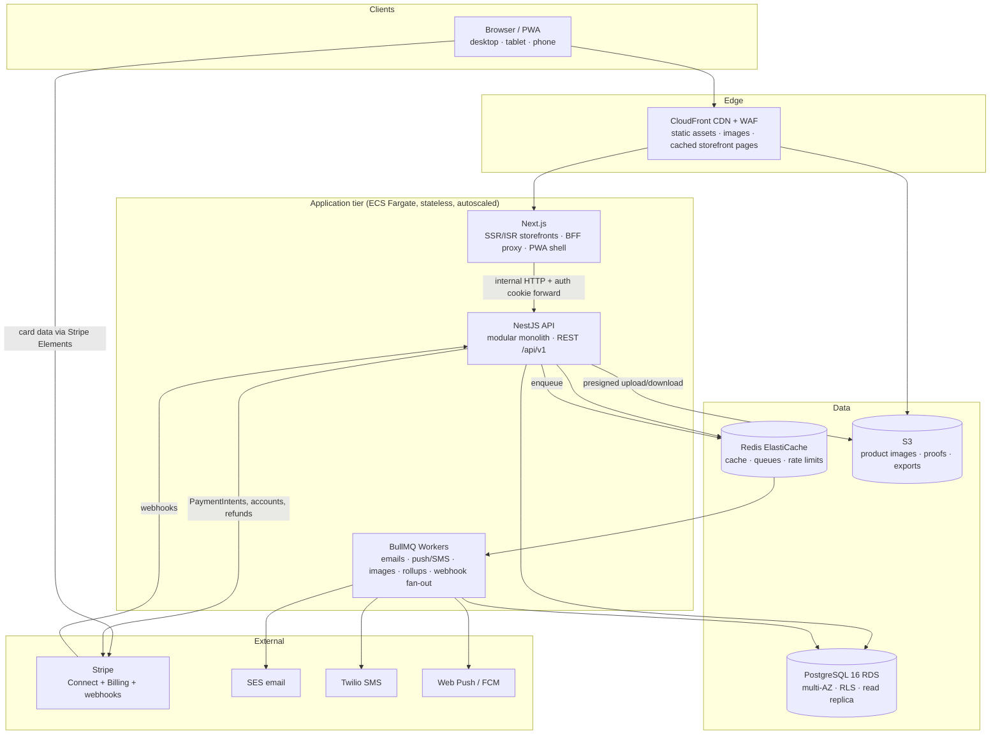

# 7. System Architecture

## 7.1 Container view



## 7.2 Why this shape

**Modular monolith, not microservices.** One NestJS deployable with hard module boundaries (enforced by lint rules) and one database. At 5k stores / 50 orders-sec this is comfortably within a single well-indexed Postgres + horizontally scaled stateless app tier. Microservices would buy operational cost (n× deploys, distributed transactions across order/payment/inventory — exactly the flows that must be atomic) and no needed scale. The async seam (BullMQ) already isolates the parts most likely to be extracted later (notifications, media, reporting).

**Next.js as BFF.** The browser talks only to Next.js (same-origin), which forwards the httpOnly auth cookie to the NestJS API. This keeps tokens out of JavaScript, makes CORS trivial, and lets storefront pages be server-rendered with data fetched inside the RSC tree. Native apps later hit the NestJS API directly with bearer tokens — the API is client-agnostic (versioned REST, no Next-specific coupling).

**One relational database.** Orders, payments, stock, and refunds are relational, transactional facts. BBA3 on Firestore proved the workflows but pays for it with fan-out denormalization, no joins for reporting, and rules-file-only isolation. Postgres gives ACID checkout (reserve stock + create order + record payment in one transaction), SQL reporting, FKs, and RLS.

## 7.3 Tenancy model (the load-bearing decision)

**Shared database, shared schema, `store_id` discriminator + PostgreSQL Row-Level Security.**

| Option | Verdict |
|--------|---------|
| DB-per-tenant | Rejected: 5k databases = migration/backup/connection sprawl; kills cross-store customer accounts and platform reporting |
| Schema-per-tenant | Rejected for v2: same migration sprawl at 5k schemas; kept as documented escape hatch for a future "dedicated" enterprise tier |
| **Shared schema + RLS** | **Chosen**: one migration path, cheap tenants, platform-wide queries for Super Admin, DB-enforced isolation |

Enforcement stack (each layer independent — details in [13-security-design.md](13-security-design.md)):

```
1. JWT claims        memberships [{storeId, role}] in access token
2. API guard         route permission + storeId param ∈ claims
3. Service layer     ownership checks for customer resources
4. PostgreSQL RLS    policies on every tenant table keyed to
                     transaction-local settings (app.store_id, app.user_id, app.is_super_admin)
```

The API opens every request's DB work in a transaction that first executes `set_config('app.store_id', …, true)` etc. (Prisma client extension — see [12-backend-architecture.md](12-backend-architecture.md)). A query that "forgets" a `WHERE store_id` returns zero foreign rows instead of leaking them. CI runs a cross-tenant probe suite that must pass to deploy (NFR-SEC-01).

## 7.4 Request lifecycles

**Public storefront page (guest):** CDN → (miss) Next.js ISR render → API public endpoints (no auth) → Postgres. Page cached at CDN/ISR for 60 s; product mutations enqueue tag revalidation. Result: NFR-PRF-02 (< 200 ms TTFB cached).

**Authenticated API call:** Browser → Next.js BFF (cookie) → API: JWT verify → tenant guard → service → RLS-scoped transaction → response envelope. Access token refresh handled transparently by BFF on 401 (single retry with rotation).

**Checkout:** see sequence in [05-user-journeys.md](05-user-journeys.md) §5.3 — the only flow allowed to span an external call between DB transactions; consistency is restored by the idempotent Stripe webhook handler plus the 30-minute expiry job.

## 7.5 Caching (explicit rules per layer)

| Layer | What | TTL / invalidation |
|-------|------|--------------------|
| CDN | Static assets, product images (immutable URLs) | 1 y, content-hashed filenames |
| CDN + ISR | Storefront pages (landing, listing, product) | 60 s + tag revalidation on product/store mutation |
| Redis | Effective-permission sets per membership | 5 min TTL + explicit bust on staff/permission change |
| Redis | Hot catalog reads (store profile, category tree) | 5 min + bust on write |
| Redis | Rate-limit counters, checkout idempotency keys | sliding window / 24 h |
| None | Orders, inventory levels, payments — always fresh reads | correctness over speed |

## 7.6 Async jobs (BullMQ queues)

| Queue | Jobs | Trigger |
|-------|------|---------|
| notifications | email render+send, push, SMS, in-app fan-out | domain events (outbox) |
| media | image re-encode, responsive sizes, EXIF strip | upload completed |
| orders | PENDING expiry sweep, abandoned-cart marking | scheduled (1 min / hourly) |
| reporting | daily_store_sales rollups, CSV export builds | nightly + on-demand |
| webhooks | Stripe event processing (verify → enqueue → handle) | Stripe POST |
| housekeeping | token purge, soft-delete purge (90 d), session cleanup | scheduled |

All jobs idempotent; retry ×5 exponential; dead-letter queue alerts to the platform health page (NFR-AVL-05).

## 7.7 Search

v2.0: Postgres full-text search (`tsvector` on product name/description/brand + `pg_trgm` for fuzzy store search) with GIN indexes — zero extra infrastructure, adequate at ≤ 5k products/store. The search service is behind an interface; Meilisearch/Elasticsearch slots in at v2.x if relevance or volume demands (see [17-future-enhancements.md](17-future-enhancements.md)). This is a deliberate "don't pay for Elasticsearch yet" decision.

## 7.8 Technology choices & rationale

| Concern | Choice | Why (and why not the alternative) |
|---------|--------|-----------------------------------|
| Frontend | **Next.js 15 + React + TypeScript** | SSR/ISR for SEO-critical storefronts, App Router RSC cuts client JS, one framework for all four surfaces; team already fluent from BBA3 |
| UI | **Tailwind CSS + shadcn/ui** | BBA3 rule (Tailwind-only) carried forward; shadcn = owned, accessible primitives, not a locked-in kit |
| Backend | **NestJS + TypeScript** | Opinionated modules/DI/guards map 1:1 to our RBAC + module boundaries; first-class OpenAPI generation; one language across the stack |
| Database | **PostgreSQL 16 (RDS)** | ACID for money+stock, RLS for tenancy, FTS for v2.0 search, JSONB where flexibility is earned (variant attrs, branding) |
| ORM | **Prisma** | Type-safe queries end-to-end, migration story, client-extension hook is where tenant context is injected. (Drizzle acceptable; Prisma chosen for maturity + team velocity) |
| Auth | **Self-issued JWT (jose) + Passport strategies; Google OAuth** | Auth is a core domain (memberships in claims) — not outsourced to a hosted IdP; argon2id hashing; TOTP for MFA |
| Cache/queue | **Redis + BullMQ** | One dependency serves cache, rate limits, and a mature TS job queue with retries/DLQ |
| Storage | **S3 + CloudFront** | Presigned direct uploads keep image bytes off the API; CDN + WAF at the edge |
| Payments | **Stripe Connect (destination charges) + Stripe Billing** | Preserves BBA3's proven per-store account isolation; application fee = platform revenue; Billing handles SaaS plans/dunning; SAQ-A scope |
| Email/SMS/Push | **SES / Twilio / Web Push(FCM)** | Cheap, boring, replaceable behind a notification provider interface |
| Deploy | **Docker → ECS Fargate, Terraform, GitHub Actions** | Managed containers without Kubernetes' operational tax at this team size; K8s is a documented later option, not a launch requirement |
| Observability | **OpenTelemetry + Sentry + CloudWatch** | Traces across BFF→API→DB, release-tagged errors, SLO alerting (NFR-OPS-02/03) |

## 7.9 Monorepo layout

```
bba/
  apps/
    web/        Next.js (all four surfaces)
    api/        NestJS
    worker/     BullMQ processors (imports api's domain modules)
  packages/
    shared/     zod schemas, DTO types, permission catalog, order state machine
    ui/         shared React components (§6.3)
    config/     eslint, tsconfig, tailwind presets
  infra/        Terraform
  docs/         this document set
```

The order state machine and permission catalog live in `packages/shared` — one definition consumed by API guards, worker logic, and UI (`StatusActionBar`, `RequirePermission`), so client and server can never disagree about what's allowed.
