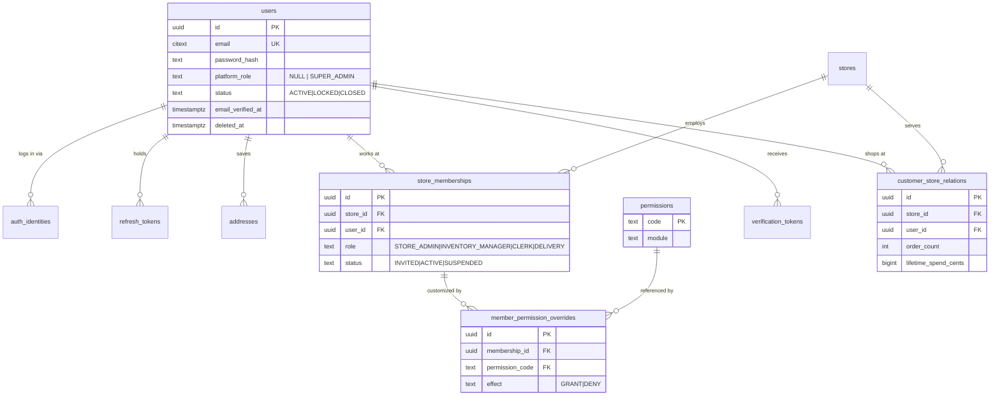
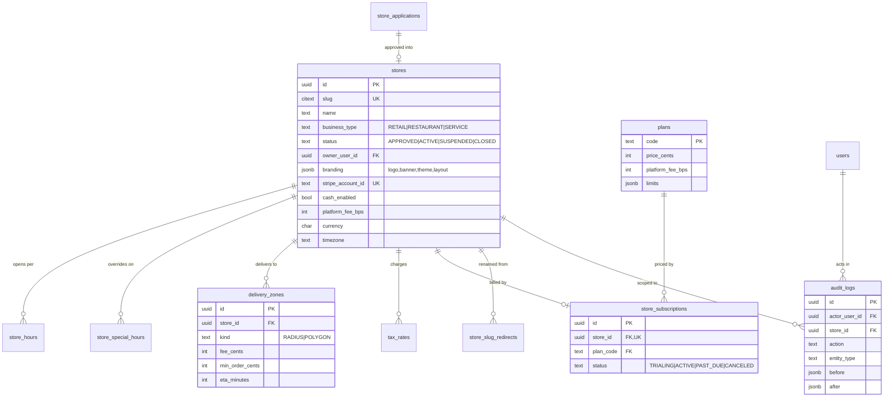
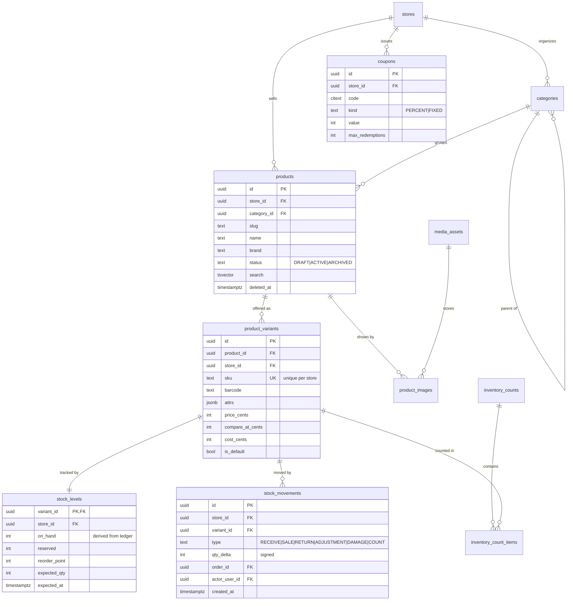
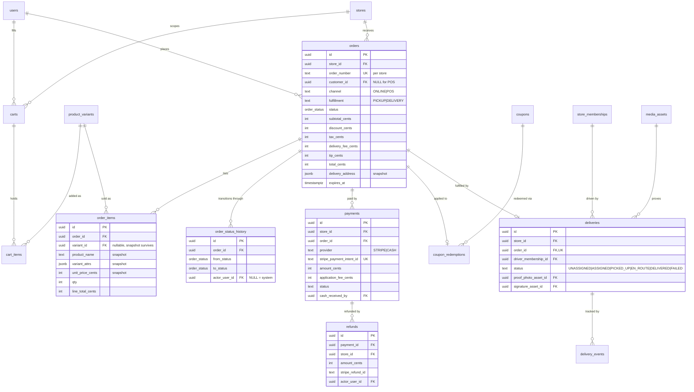
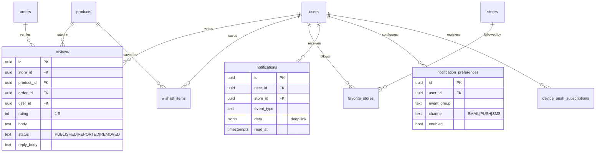

# 9. ER Diagram

Split by domain for readability; all diagrams describe the single schema in [08-database-schema.md](08-database-schema.md). Attributes shown are keys plus the columns that carry meaning for relationships — see §8.2 for the complete column list.

Cardinality notation: `||--o{` = one-to-many, `||--||` = one-to-one, `}o--||` = many-to-one optional.

## 9.1 Identity, memberships & tenancy

**Key point:** `store_memberships` is the join that makes multi-tenancy work at the identity layer — one `users` row can hold a CLERK membership at store A and a STORE_ADMIN membership at store B, while shopping anywhere as a customer with no membership at all.

## 9.2 Store configuration & platform

## 9.3 Catalog & inventory

**Key point:** `stock_movements` is append-only and authoritative; `stock_levels.on_hand` is a trigger-maintained cache of the ledger sum. Any disagreement is a bug the nightly reconciliation job catches (§8.5).

## 9.4 Shopping, orders, payments & delivery

**Key point:** `order_items` carries snapshots (name, attrs, price) rather than relying on joins to `product_variants`. A store that renames, reprices, or deletes a product must never alter the historical record of what a customer bought — this is the one place denormalization is mandatory, not optional.

## 9.5 Engagement & notifications

## 9.6 Relationship summary

| From | To | Cardinality | Delete behavior |
|------|----|-------------|-----------------|
| stores | store_memberships | 1:N | RESTRICT (close store first) |
| users | store_memberships | 1:N | CASCADE on hard purge |
| stores | products | 1:N | RESTRICT; products soft-deleted |
| products | product_variants | 1:N (≥1 always) | CASCADE |
| product_variants | stock_levels | 1:1 | CASCADE |
| product_variants | stock_movements | 1:N | RESTRICT (ledger is permanent) |
| stores | orders | 1:N | RESTRICT (financial record) |
| orders | order_items | 1:N | CASCADE |
| orders | payments | 1:N (retries) | RESTRICT |
| payments | refunds | 1:N (partials) | RESTRICT |
| orders | deliveries | 1:0..1 | CASCADE |
| store_memberships | deliveries | 1:N (driver) | SET NULL (driver leaves, history stays) |
| orders | reviews | 1:N (per product) | RESTRICT |

The pattern: **operational rows cascade, financial and ledger rows restrict.** Nothing that a tax authority or a chargeback investigation might need can be deleted by an application action.
