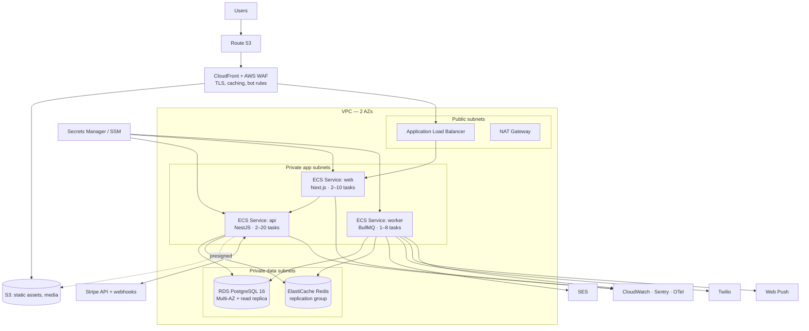
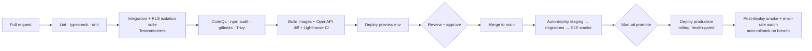

# 14. Deployment Architecture

AWS, containerized, Terraform-managed. **ECS Fargate rather than Kubernetes** — at this team size and scale, EKS buys flexibility nobody needs in exchange for a control plane someone has to own. The migration path to EKS exists (the same container images) if scale or multi-region requirements later justify it.

## 14.1 Production topology

Network rules: only the ALB is internet-facing; app tasks sit in private subnets with egress via NAT; data subnets accept traffic only from app security groups. Stripe webhooks arrive at the ALB on a dedicated path with WAF rules permitting Stripe's published IP ranges.

## 14.2 Environments

| Environment | Purpose | Infrastructure | Data | Stripe |
|-------------|---------|---------------|------|--------|
| **local** | Development | docker-compose (Postgres, Redis, MinIO, Mailpit) | Seeded fixtures: 3 stores, staff for every role, 200 products | Test mode + Stripe CLI webhook forwarding |
| **preview** | Per-PR review | Ephemeral ECS service + shared preview DB (schema per PR) | Anonymized seed | Test mode |
| **staging** | Pre-production verification | Prod-shaped, smaller task counts, single-AZ RDS | Anonymized production-like volume; E2E and load tests run here | Test mode |
| **production** | Live | Full topology above | Real | Live mode |

Non-negotiable: staging runs the same images and the same migrations as production. Stripe live keys exist only in production's secret store.

## 14.3 CI/CD

Gates that block a release: any failing test, the **cross-tenant isolation suite** (NFR-SEC-01), High/Critical vulnerabilities, an OpenAPI breaking change without a version bump, or a Lighthouse budget regression.

**Deployment mechanics:** immutable images tagged by commit SHA; ECS rolling update with circuit breaker; ALB health checks on `/health/ready`; one-click rollback redeploys the previous task definition (NFR-OPS-07).

**Migrations:** run as a one-off ECS task *before* the new app version rolls out, using the expand→migrate→contract pattern so old and new code both function against the intermediate schema (NFR-AVL-02). Destructive steps (column drops) ship at least one release after the code stops referencing them.

## 14.4 Scaling & capacity

| Tier | Baseline | Autoscaling trigger | Ceiling |
|------|----------|--------------------|---------|
| web (Next.js) | 2 × 1 vCPU / 2 GB | CPU > 60% or ALB req/target > 800 | 10 |
| api (NestJS) | 2 × 1 vCPU / 2 GB | CPU > 60% or p95 latency > 400 ms | 20 |
| worker | 1 × 0.5 vCPU / 1 GB | Queue depth > 500 or oldest job > 60 s | 8 |
| RDS | db.m7g.large, Multi-AZ | Vertical; read replica for reports/exports | db.m7g.2xlarge before sharding is considered |
| Redis | cache.t4g.medium, 2 nodes | Memory > 70% | cache.m7g.large |

Connection management matters more than task count: PgBouncer (transaction pooling) sits in front of RDS so 20 API tasks × pool size never exhausts Postgres connections. Prisma's pool is sized deliberately (10/task), not left at defaults.

Known scaling order when growth demands it: (1) read replica for reporting, (2) pre-aggregated rollups already in the schema, (3) partition `orders` and `stock_movements` by month, (4) extract notifications/media workers to their own service, (5) only then reconsider tenancy topology.

## 14.5 Observability & alerting

| Concern | Tooling |
|---------|---------|
| Metrics | CloudWatch (ECS, ALB, RDS, ElastiCache) + custom business metrics (orders/min, checkout success rate, webhook lag) |
| Logs | CloudWatch Logs, structured JSON, 90 d hot / 1 y S3 archive (NFR-OPS-01) |
| Traces | OpenTelemetry → X-Ray (or Grafana Tempo), spanning BFF → API → DB/Redis/Stripe |
| Errors | Sentry, release-tagged, with source maps uploaded at build |
| Uptime | External synthetic checks on storefront, login, and checkout-quote from three regions |

**Alert policy — page a human only for these:** availability SLO burn, checkout success rate < 98% over 10 min, webhook processing lag > 5 min, DB CPU > 85% or connections > 80%, dead-letter queue non-empty, disk/memory pressure, and any HIGH-severity security audit event (privilege escalation, impersonation, mass refund). Everything else is a dashboard or a ticket — alert fatigue is an availability risk of its own.

## 14.6 Backup & disaster recovery

| Asset | Backup | Recovery |
|-------|--------|----------|
| PostgreSQL | Automated daily snapshots + PITR (5-min granularity), 35-day retention, cross-region snapshot copy | **RPO ≤ 15 min, RTO ≤ 4 h** (NFR-OPS-05) |
| S3 media | Versioning + lifecycle to Glacier at 1 y; cross-region replication for the public prefix | Restore by version |
| Redis | Not backed up — treated as disposable cache; queues are reconstructible from the outbox table | Rebuild on start |
| Infrastructure | Terraform state in S3 with locking; all resources reproducible from code | < 1 day in an alternate region (NFR-OPS-06) |
| Secrets | Secrets Manager replication to the DR region | Automatic |

**DR posture:** multi-AZ within region is the launch commitment (survives an AZ loss automatically). Full region loss is a documented manual runbook — restore snapshot, `terraform apply` in the DR region, repoint Route 53 — exercised in the quarterly drill along with the restore test. Warm standby is deliberately deferred; it doubles infrastructure cost to improve an RTO that a business at this stage can tolerate.

## 14.7 Cost outline (order of magnitude, 100 active stores)

| Item | Monthly (USD) |
|------|--------------|
| ECS Fargate (web + api + worker, baseline) | ~$220 |
| RDS Multi-AZ db.m7g.large + storage | ~$380 |
| ElastiCache (2 nodes) | ~$95 |
| ALB + NAT + data transfer | ~$130 |
| S3 + CloudFront | ~$60 |
| SES / Twilio / Sentry / monitoring | ~$120 |
| **Total infrastructure** | **~$1,000** |

At ~$10/store/month in infrastructure against the **$49/store/month price** ([§18.5a](18-final-recommendations.md#185a-pricing--49storemonth)), gross margin reaches ~80% at 100 stores and ~88% at 500. Below roughly 50 stores the fixed floor dominates and the pilot runs near break-even — expected, and not a reason to reprice.

Cost drivers to watch as stores grow are NAT data transfer and RDS storage IOPS, not compute. Stripe's own processing fees pass through to each store's connected account. Platform revenue is the subscription; whether BBA additionally takes a per-transaction application fee is still open — see [§18.6](18-final-recommendations.md#186-the-one-decision-still-open-transaction-fee).

## 14.8 Domains & TLS

- `bba.app` — platform + store directory; `bba.app/stores/{slug}` — storefronts (single origin keeps SEO authority consolidated and CSP simple).
- `cdn.bba.app` — CloudFront for static and media (separate origin so a media CSP bypass cannot reach app cookies).
- Custom store domains (e.g. `sunrisebakery.com`) are a v2.x enhancement requiring per-tenant ACM certs and host-based routing — designed for, not built at launch (§17).
- ACM certificates with automatic renewal; TLS terminated at CloudFront and again at the ALB (end-to-end encryption inside the VPC).
