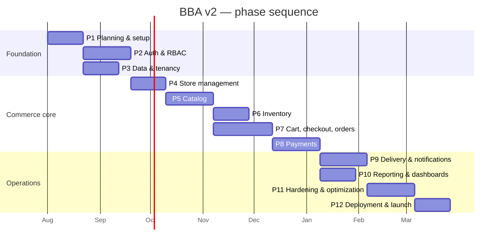

# 15. Development Roadmap

Twelve phases. Complexity is **S / M / L / XL** (relative effort, not calendar promises); the indicative durations assume a team of 3–4 engineers (2 full-stack, 1 frontend-leaning, 1 backend-leaning) plus part-time design and QA.

**Total indicative timeline: ~9 months to production launch**, with a usable internal demo at the end of Phase 7 (~month 5).

Phases 3 and 2 run in parallel after Phase 1; 6 and 7 overlap once the catalog is stable; 10 runs alongside 9.

---

## Phase 1 — Planning & Foundation · **M** · ~3 weeks

**Goals** — Lock the contracts everything else depends on; make the repository productive on day one.

**Tasks**
- Monorepo scaffold (Turborepo): `apps/web`, `apps/api`, `apps/worker`, `packages/shared|ui|config`.
- `packages/shared`: permission catalog, order state machine, zod DTOs, error-code enum — the contracts from §4, §5.1, §10.
- Local dev environment: docker-compose (Postgres, Redis, MinIO, Mailpit), seed script, one-command startup.
- CI skeleton: lint, typecheck, unit, build; branch protection.
- Terraform bootstrap: VPC, ECR, state backend, staging RDS/Redis.
- Design system foundation: Tailwind preset, shadcn/ui install, tokens, `StatusBadge`/`DataTable`/form primitives.
- ADR process established; this document set becomes the baseline.

**Deliverables** — Running skeleton app deployed to staging; shared contracts package; CI green; ADR-0001 through ADR-0005 recording the decisions in §7.8.

**Dependencies** — None. **Risk** — Over-designing the shared package; keep it to contracts, not business logic.

---

## Phase 2 — Authentication & RBAC · **L** · ~4 weeks

**Goals** — Every subsequent feature can assume a correct identity and permission answer.

**Tasks**
- Registration, email verification, login, logout, password reset (FR-AUTH-01…05, 09, 10).
- JWT issuance with membership claims; refresh rotation with family-reuse detection; session list/revoke.
- Google OAuth; account linking by verified email.
- TOTP MFA + recovery codes; enforcement for privileged roles (FR-AUTH-08).
- Membership model, invitation flow (owner and staff), acceptance (FR-AUTH-11).
- `PermissionsGuard`, effective-permission resolution + Redis cache, guardrailed overrides (§4.4, §12.5).
- Frontend: auth pages, `RequirePermission`, session context, role-aware post-login routing.
- Audit interceptor + `audit_logs` table with HIGH-severity events wired.

**Deliverables** — Full auth surface; permission matrix from §4.5 enforced and unit-tested; auth E2E suite.

**Dependencies** — Phase 1. **Risk** — Refresh rotation edge cases; write the token-family tests before the implementation.

---

## Phase 3 — Data Model & Tenancy · **L** · ~3 weeks (parallel with Phase 2)

**Goals** — The isolation guarantee, proven rather than promised.

**Tasks**
- Full Prisma schema per §8; migrations with RLS policies as reviewed SQL.
- Tenant-context Prisma extension (§12.4); repository base classes.
- RLS policies for all four families (tenant, customer-owned, dual, platform-only) with `WITH CHECK` on writes.
- Triggers: `updated_at`, stock-ledger → `stock_levels`, order-total verification, illegal-transition backstop, category depth.
- Seed data: 3 stores across business types, staff for every role, realistic catalog and order history.
- **Cross-tenant isolation test suite** + the "every store_id table has RLS" migration test; wire both as CI release gates.

**Deliverables** — Migrated schema on staging; isolation suite passing and blocking; seeded environments.

**Dependencies** — Phase 1 (schema decisions), Phase 2 (membership shape). **Risk** — RLS misconfiguration; the coverage test exists precisely to catch the table someone forgets.

---

## Phase 4 — Store Management & Platform Admin · **M** · ~3 weeks

**Goals** — A store can exist, be approved, be configured, and be staffed.

**Tasks**
- Store application intake → Super Admin review → provisioning + owner invite (FR-PLAT-01, §5.7).
- Store profile, branding editor (with contrast validation), hours + special hours, delivery zones (radius/polygon + geocoding), tax rates.
- Store lifecycle: approve/suspend/reactivate/close, with 60-second propagation of suspension.
- Staff management UI: invite, roles, guardrailed permission matrix, suspend.
- Platform surfaces: dashboard shell, store list/detail, user management, audit log search.
- Storefront shell rendering branding + the three layout templates (ported conceptually from BBA3).
- Media upload pipeline end-to-end (§13.7) — needed first for logos/banners.

**Deliverables** — Onboarding works end to end: application → approved → configured → published shell. Platform admin usable.

**Dependencies** — Phases 2, 3. **Risk** — Zone geometry and geocoding; keep radius zones as the launch default, polygons as the advanced option.

---

## Phase 5 — Catalog · **L** · ~4 weeks

**Goals** — Stores can build a catalog; guests can browse it.

**Tasks**
- Categories/subcategories with ordering; product CRUD with status lifecycle; default-variant creation.
- Variant matrix editor (attributes, SKU, barcode, pricing, cost); SKU uniqueness per store.
- Multi-image upload with reordering; responsive image delivery.
- Coupons and scheduled promotions (FR-CAT-06).
- Public storefront: listing with filters/sort, product detail, Postgres FTS search (§7.7), store directory with fuzzy search.
- SEO: ISR + tag revalidation, metadata, JSON-LD (`LocalBusiness`, `Product`, `Offer`), sitemaps, canonical/redirect handling.
- CSV import/export (async job).

**Deliverables** — Publicly browsable, indexable storefronts with real catalogs; Lighthouse budgets met on catalog pages.

**Dependencies** — Phase 4. **Risk** — ISR invalidation correctness; make revalidation an explicit domain-event consumer, not an afterthought.

---

## Phase 6 — Inventory · **M** · ~3 weeks

**Goals** — Stock is a ledger, not a number someone edits.

**Tasks**
- `stock_levels` + append-only `stock_movements` with trigger-maintained on-hand; reservation semantics.
- Receiving flow with expected qty/ETA (BBA3 parity); adjustments with reason codes; damage handling.
- Physical count sessions: open → enter → review → post variances.
- Low-stock detection job + alerts to Inventory Manager and Store Admin.
- Barcode lookup and camera scanning (PWA) for receiving and counting.
- Inventory reports: valuation, low stock, movement history; nightly ledger reconciliation job.

**Deliverables** — Inventory Manager dashboard complete; stock provably equals its ledger.

**Dependencies** — Phase 5. **Risk** — Reservation/oversell races; test with concurrent checkout simulations, not sequential ones.

---

## Phase 7 — Cart, Checkout & Orders · **XL** · ~5 weeks

**Goals** — The revenue path. The riskiest phase; budget accordingly.

**Tasks**
- Cart per store, guest session cart, merge on login; line revalidation.
- Checkout quote engine: pricing, coupons, tax, delivery zone + fee, tip. **Tax goes behind a `TaxProvider` interface** with a configured-rate implementation for the Illinois launch — the seam that makes multi-state expansion a swap rather than a migration ([§18.5b](18-final-recommendations.md#185b-geographic-scope--illinois-first)).
- Order creation transaction (§12.6) with stock reservation, per-store order numbers, idempotency.
- Order state machine service with permission-gated transitions and status history.
- Clerk order queue (tablet-optimized), order workbench, cancel/return flows, PENDING expiry sweeper.
- POS walk-in sales with barcode entry and cash tender.
- Customer order tracking, history, receipts; print documents (receipt, pick list).
- SSE event stream for live queue and tracking updates.

**Deliverables** — A complete order can be placed, fulfilled for pickup, cancelled, and returned — cash payments only at this point. **Internal demo milestone.**

**Dependencies** — Phases 5, 6. **Risk** — Highest in the project; hold the transaction boundary discipline in §12.6 and write the concurrency tests first.

---

## Phase 8 — Payments · **L** · ~4 weeks

**Goals** — Money moves correctly, to the right store, exactly once.

**Tasks**
- Stripe Connect onboarding (Express accounts) with status surfacing in store settings.
- PaymentIntent creation with destination charges + application fee; Payment Element on checkout.
- Webhook endpoint: signature verification, event persistence, idempotent handlers, order/payment state sync.
- Refunds (full/partial) routed through the originating store's connected account; cash refund recording.
- Cash payment confirmation flow with `payments:collect-cash` (successor to BBA3 receivers).
- Stripe Billing: plans, subscriptions, dunning, plan-gated limits.
- Payment failure UX: retry, expiry, clear messaging; dispute webhook → store notification.
- Connected-account isolation tests (a refund can never touch another store's account).

**Deliverables** — End-to-end paid orders in Stripe test mode; subscription billing operational; PCI SAQ-A posture documented.

**Dependencies** — Phase 7. **Risk** — Webhook ordering and duplicates; the outbox + event-id idempotency in §12.8/§12.10 is the answer, and it must be tested with deliberately replayed and out-of-order events.

---

## Phase 8.5 — AI Store Opening Agent · **L** · ~4 weeks

**Goals** — Compress "approved application" to "open for business" from days to an afternoon, and remove the owner's learning curve by handing over a store that already works. Directly targets R5 (adoption) and R6 (staff usability).

Full design: [19-ai-onboarding-agent.md](19-ai-onboarding-agent.md).

**Operator model:** SuperAdmin-only, in-app. The agent is the `/platform/openings` console — no CLI, no external tool, no owner self-serve. Owners contribute an intake packet, complete Stripe KYC, and sign off before go-live; nothing else.

**Tasks**
- Agent saga infrastructure: `agent_runs` / `agent_run_steps` / `agent_run_messages`, BullMQ orchestration, resumability, scoped service identity, audit wiring.
- **Time-boxed provisioning scope**: grant on run start (APPROVED stores only), auto-revoke at completion/cancel/go-live, excluded surfaces enforced, added to the CI cross-tenant probe suite.
- Tool layer over existing services with zod schemas; read/draft tools execute, consequential tools queue for approval.
- **In-app console**: run list, three-pane console (steps / conversation / proposal review), per-step review screens, SSE progress, stalled-openings widget on platform health.
- **Owner intake** upload flow and completeness check; **owner sign-off walkthrough** with per-section acceptance gating go-live and staff invitation dispatch.
- Claude Opus 5 tool-calling loop with prompt caching, task budget, structured-output validation, refusal fallbacks, per-run cost cap.
- Function 1 — store profile drafting with business-type-aware defaults and contrast-validated branding.
- Function 4 — staff roster drafting, guardrailed permission suggestions, approval-gated invitations, role orientation pages.
- Function 2 — catalog drafting from photos/CSV/menu/website; `ImageProvider` interface; enhance-first imagery pipeline; provenance fields and illustrative badging.
- Function 3 — Stripe Connect orchestration state machine, webhook-driven requirement monitoring, plain-English requirement translation, nightly drift reconciliation, stalled-store dashboard.
- Owner-facing run UI (proposal review, diffs, approvals, SSE progress) and Super Admin run monitoring.
- Handoff summary, first-week checklist, guided tour on real data.

**Deliverables** — A store owner with a shoebox of product photos and no technical help is taking real orders within two hours, and can process one unaided.

**Dependencies** — Phases 3 and 4 (slice A), Phase 5 (catalog slice), Phase 8 (Stripe slice). Delivered in four slices (§19.12) so profile + staff can ship before catalog and Stripe orchestration.

**Risk** — Consumer-protection exposure on generated product imagery (R19) and prompt injection via ingested content (R21). Both are mitigated structurally by the approval gates — do not add an "auto-approve everything" mode without an ADR.

---

## Phase 9 — Delivery & Notifications · **L** · ~4 weeks

**Goals** — Orders leave the store and everyone stays informed.

**Tasks**
- Delivery records, driver assignment, status transitions synced to orders.
- Driver PWA experience: today's queue, navigation hand-off, photo proof, signature capture, failure reasons.
- Offline queue with Background Sync for driver status updates (§11.8).
- Notification service: event catalog → channel fan-out, templates with store branding, preferences.
- Email (SES), web push (FCM), in-app inbox; SMS (Twilio) behind a store toggle.
- Platform announcements.

**Deliverables** — Full delivery lifecycle with proof; all notification touchpoints from §5.9 firing.

**Dependencies** — Phase 8. **Risk** — Mobile capture reliability on low-end Android; test on real devices early, not in an emulator at the end.

---

## Phase 10 — Reporting & Dashboards · **M** · ~3 weeks (parallel with Phase 9)

**Goals** — Owners can answer "how is my store doing?" without exporting anything.

**Tasks**
- Report queries: sales (by day/week/month, channel, payment method), top products, inventory, taxes, refunds, customers, staff.
- `daily_store_sales` rollup job + incremental updates; read-replica routing for heavy queries.
- Store Admin dashboard (KPIs, pipeline, low stock, pending actions); role landing dashboards.
- Platform dashboard: GMV, MRR, store counts, order volume, health feed.
- Charts (Recharts) with accessible tabular fallbacks; CSV export as async jobs.
- Store customer list with LTV; reviews and replies.

**Deliverables** — Every dashboard in §6.2 populated with real data, meeting the < 2 s p95 target.

**Dependencies** — Phases 7, 8. **Risk** — Report queries degrading as data grows; write them against a seeded 1M-row dataset from the start.

---

## Phase 11 — Hardening & Optimization · **L** · ~4 weeks

**Goals** — Turn a feature-complete app into a production-grade one.

**Tasks**
- Third-party penetration test; remediate High/Critical (launch blocker).
- Load testing at 2× NFR-SCL targets; fix the bottlenecks it finds (expected: report queries, N+1s, connection pooling).
- Accessibility audit: axe sweep + manual screen-reader pass; remediate to WCAG 2.2 AA.
- Performance: bundle analysis, image budgets, cache-hit-rate tuning, index review against real query plans.
- Full observability wiring: dashboards, SLO alerts, runbooks for every alert.
- Backup restore drill and DR runbook rehearsal.
- Error-state and empty-state polish; copy review for the plain-language rule (§6.4).
- Documentation: API docs published, store owner help center, internal runbooks.

**Deliverables** — Pen-test remediation complete; load and a11y targets met; runbooks written and rehearsed.

**Dependencies** — Phases 9, 10. **Risk** — The temptation to add features here; protect this phase.

---

## Phase 12 — Deployment & Launch · **M** · ~3 weeks

**Goals** — Go live with real money and real stores, safely.

**Tasks**
- Production infrastructure via Terraform; secrets, domains, TLS, WAF rules.
- Stripe live-mode activation; platform Connect settings; payout verification with a test store.
- Data migration from BBA3 (see [18-final-recommendations.md](18-final-recommendations.md)) for existing stores, with a dry run on staging first.
- Pilot: 3–5 friendly stores in production for two weeks, with daily check-ins and a rapid fix loop.
- Monitoring validation: trigger each alert deliberately and confirm it pages.
- Go-live checklist, support rotation, rollback rehearsal.
- Public launch + onboarding of the first cohort.

**Deliverables** — Production platform live; pilot stores transacting; support and on-call operating.

**Dependencies** — Phase 11. **Risk** — Migration surprises; the dry run is mandatory, and the pilot cohort must be small enough to hand-hold.

---

## Cross-cutting workstreams (continuous, not phases)

| Workstream | Practice |
|-----------|----------|
| Testing | Tests ship with features; the isolation suite and E2E journeys grow every phase |
| Security | Threat review at each phase boundary; dependency scanning always on |
| Design | Runs one phase ahead of engineering |
| Docs | ADRs on every deviation; this document set updated when reality diverges from it |

## Milestones

| Milestone | End of | Meaning |
|-----------|--------|---------|
| **M1 Foundation** | Phase 3 | Identity, permissions, and proven tenant isolation |
| **M2 Storefront** | Phase 5 | Public, SEO-indexed storefronts with real catalogs |
| **M3 Commerce** | Phase 7 | Orders flow end to end (cash) — internal demo |
| **M4 Revenue** | Phase 8 | Real payments and subscriptions |
| **M5 Operations** | Phase 10 | Delivery, notifications, and reporting complete |
| **M6 Launch** | Phase 12 | Production, pilot validated, public |
