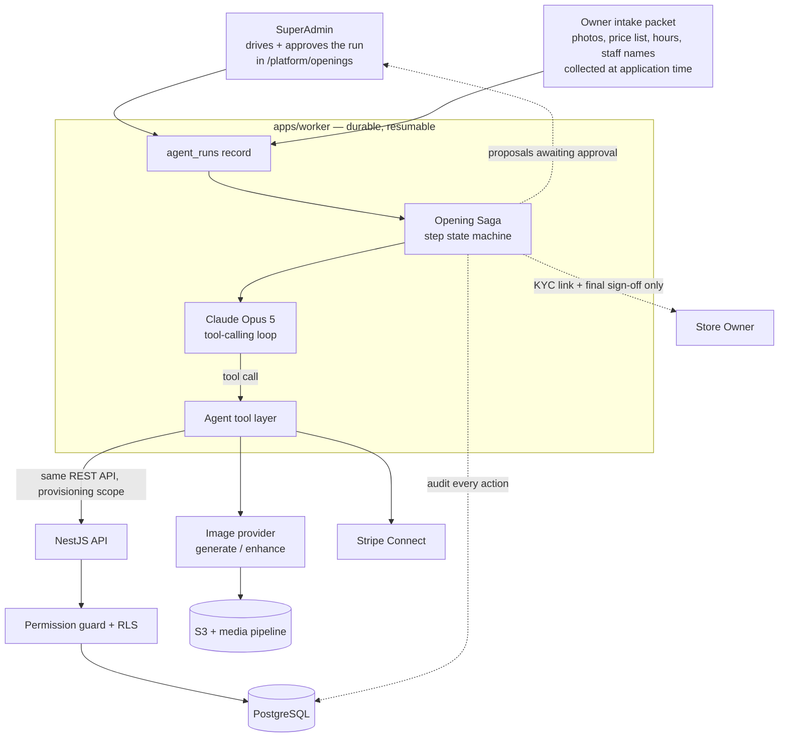
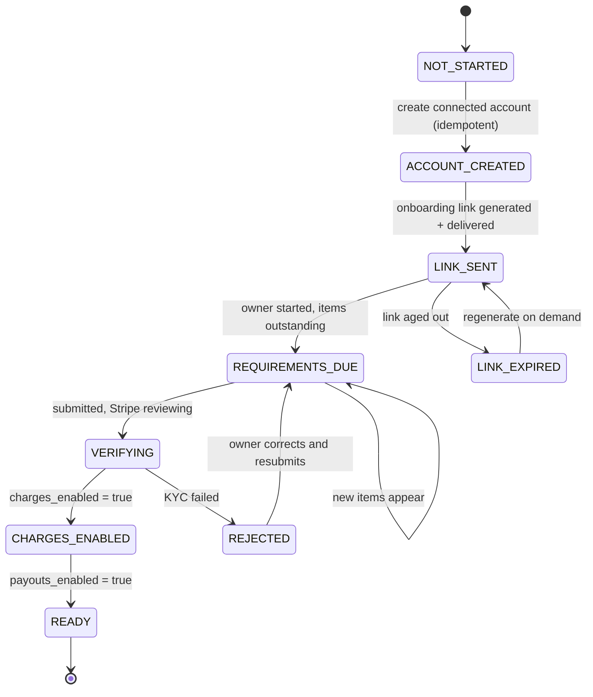

# 19. AI Store Opening Agent

**Status:** Design change, added 2026-07-31. Operator model confirmed 2026-07-31. Extends the plan in sections 1–18.

An AI agent that takes a store from "approved application" to "open for business" — profile, catalog with imagery, payments, and staff — so the owner's first login lands on a working store rather than an empty shell.

> ### Operator model (decided)
>
> **The agent is operated exclusively by the SuperAdmin, from inside the BBA platform app.**
>
> - It is a screen in the platform surface (`/platform/openings/…`), not a CLI, a script, an external console, or a self-serve owner feature.
> - The SuperAdmin drives the entire run and approves every proposal. Store owners have no access to the agent and cannot start, steer, or approve a run.
> - This mirrors the BBA3 provisioning model the business already runs on: the platform opens the store *for* the owner, and hands over a working one.
>
> Two things still require the owner, for legal and practical reasons that no design choice can remove — see [§19.6b](#196b-what-the-owner-must-still-do): **Stripe KYC identity verification**, and a **final sign-off before the storefront goes public**. Everything else is the SuperAdmin's.

**The goal is not automation for its own sake.** It is [§16 R5](16-risks-mitigation.md#161-risk-register) (low store adoption) and [§16 R6](16-risks-mitigation.md#161-risk-register) (staff can't use the tools) — the two business risks engineering can least fix after launch. A store that goes live in an afternoon with 40 real products and a working checkout is a store that keeps paying. A store staring at an empty catalog on day three is churn.

---

## 19.1 The governing principle: the LLM proposes, deterministic code disposes

Every capability below splits the same way:

| The model does | Deterministic code does |
|---|---|
| Draft a store description from a business name and a photo | Write the `stores` row, validate the slug, enforce uniqueness |
| Read 40 product photos and propose names, categories, prices | Create `products` + `product_variants` in DRAFT, enforce SKU uniqueness, reject malformed prices |
| Write an image-generation prompt and QA the result | Call the image provider, run the upload pipeline ([§13.7](13-security-design.md#137-file-upload-pipeline)), set provenance metadata |
| Explain a Stripe KYC requirement in plain English | Create the connected account, poll `account.updated`, regenerate expired links |
| Propose a staff roster from "I have two cashiers and a driver" | Create invitations with guardrailed roles, send email **after approval** |

**No judgment call from the model reaches the database unvalidated, and no side-effectful action happens because the model decided it should.** Prices, permissions, payouts, and published content each pass a deterministic gate. This is what makes the agent auditable and what keeps a prompt-injection payload in an uploaded menu from becoming a real staff account.

---

## 19.2 Where the agent sits



Three properties are load-bearing:

**The agent has no backdoor.** Its tools call the same service methods the human UI calls, through the same `PermissionsGuard` and the same RLS transaction context ([§12.4](12-backend-architecture.md#124-tenant-context-propagation)). The agent's identity is a distinct actor type — a service principal acting *on behalf of* a named SuperAdmin, scoped to exactly one `store_id` for the duration of the run. An agent bug cannot reach another tenant's data for the same reason a buggy controller cannot.

**Provisioning is a bounded exception to "platform is landlord, not operator."** [§4.3](04-roles-permissions.md#43-role--default-permissions) deliberately denies SUPER_ADMIN store operational permissions. Opening a store genuinely requires them, so the run operates under a **time-boxed provisioning scope** rather than by broadening the SuperAdmin role. Its limits are what keep it from becoming a tenant backdoor:

| Constraint | Rule |
|---|---|
| **Precondition** | A run can only start on a store in `APPROVED` status. **Never on an `ACTIVE` store** — so this can never be used to reach into a live tenant's operations. |
| Lifetime | Granted when the run starts, revoked automatically when the run completes, is cancelled, or the store reaches `ACTIVE`. |
| Breadth | Setup surfaces only: profile, hours, zones, tax, catalog, inventory seed, staff invitations, payment configuration. |
| Explicitly excluded | Orders, customers, transactions, payouts, revenue reports. There are none during provisioning, and excluding them means the scope has no read value against a running business. |
| Audit | Every action under the scope is a HIGH-severity audit event naming the SuperAdmin, the run, and the store. |

The steady state is unchanged: once a store is ACTIVE, the platform is a landlord again and has no operational access to it.

**Runs are durable, not a single call.** Stripe KYC can take days. The run is a checkpointed saga in Postgres, driven by BullMQ jobs. It pauses on human input, survives worker restarts, and resumes exactly where it stopped. Nothing is held in an LLM context window across that gap.

**It runs in `apps/worker`, not in the request path.** No HTTP request ever waits on a model call.

---

## 19.3 Function 1 — Store profile setup

**Input:** the approved `store_applications` row plus the owner's intake packet (§19.6b), interpreted by the SuperAdmin in conversation with the agent.

**What the model drafts:** store description and tagline; a business-type-appropriate category skeleton; suggested weekly hours; a branding palette and layout choice from the three templates; suggested delivery zone radius and fee based on the geocoded address and business type; the applicable tax rate for the store's jurisdiction, **presented as a suggestion requiring confirmation, never applied silently**.

**What code enforces:** slug generation and uniqueness; address geocoding; timezone/currency derivation; the WCAG AA contrast check on any proposed palette ([NFR-A11Y-03](03-non-functional-requirements.md#35-accessibility)) — a palette that fails is regenerated, not shipped with a warning.

**Business-type-aware defaults are where most of the value is.** A bakery gets morning-weighted hours, a "Fresh Today" category, and short delivery radii. A hardware store gets weekday-weighted hours, aisle-style categories, and no perishable handling. This is judgment a generic setup wizard cannot encode and an LLM does well.

**Approval gate:** the SuperAdmin reviews a side-by-side diff of every proposed field before it is written. The store stays in `APPROVED` — not publicly visible — until the publish checklist passes *and* the owner has signed off (§19.6b).

---

## 19.4 Function 2 — Product catalog and imagery

The highest-value and highest-risk function. Splitting it carefully matters.

### 19.4.1 Catalog drafting

**Input sources, in order of preference** — all supplied by the owner in the intake packet: a spreadsheet or CSV they already have; a photo of a printed menu or price list; a batch of product photos taken on a phone; their existing website; a voice note ("we sell about thirty kinds of bread, sourdough is $8…").

Claude's vision handles all of these. From 40 phone photos it drafts name, category, description, and a suggested price for each, and flags the ones it is unsure about rather than guessing confidently.

**Written to the database as `DRAFT` products only.** The SuperAdmin reviews a grid, corrects, and publishes.

**Pricing is the one place the SuperAdmin's role needs stating precisely.** They are not setting the store's prices — they are verifying the agent transcribed the owner's own price list correctly. So the review grid shows each proposed price **next to the source it came from** (the menu photo crop, the CSV row, the transcript line), and any product the agent priced without a source is flagged and cannot be published until the SuperAdmin either supplies the source or clears it explicitly. Every price is then confirmed again by the owner at sign-off (§19.6b). A wrong price is a direct financial loss to a business the platform doesn't run, so it gets two humans and a citation.

Deterministic gates: SKU uniqueness per store, price sanity bounds (reject a $4,000 croissant), category depth limit, plan product-count limits.

### 19.4.2 Imagery — three distinct paths, and why the distinction matters

**Claude does not generate images.** Its role here is analysis (reading the owner's photo), prompt authoring, and QA of whatever the image provider returns. Generation itself goes to a separate image model behind an `ImageProvider` interface — the same pattern as `PaymentProvider` ([§12.10](12-backend-architecture.md#1210-external-integrations)), so the provider choice is swappable and is not entangled with the LLM choice.

| Path | What it does | Where it's allowed |
|---|---|---|
| **Enhance** (default) | Owner's real photo → background removal, crop to consistent framing, colour/exposure correction, responsive sizes | **Any product.** This is the recommended path and produces the best result: a real photo of the real product, made to look professional |
| **Generate — non-representational** | Category tiles, store hero and banner imagery, decorative section art | Anywhere a specific purchasable item is *not* depicted |
| **Generate — product placeholder** | A generated image standing in for a product with no photo yet | **Only** with a persistent "illustrative — not the actual item" badge on the storefront, and only until a real photo replaces it |

**The rule, stated plainly: a customer must never be shown a synthetic image of a specific item they are buying without being told it is synthetic.** Beyond being the right thing to do, misrepresenting goods is a consumer-protection exposure that would land on the store owner and on BBA. The badge is not a checkbox the owner can quietly disable; removing it requires uploading a real photo.

Every asset records provenance on `media_assets`: `is_ai_generated`, the model and provider, a prompt hash, and C2PA content credentials where the provider emits them. This survives into the storefront markup and into any dispute.

**Approval gate:** no generated image is published without SuperAdmin review, and every illustrative-badged product is listed explicitly in the owner's sign-off so they know which images are not photographs of their goods. The generation budget is capped per run.

**Services:** the same drafting pipeline works for service offerings (name, description, duration, base price) — the image paths are almost entirely "generate — non-representational," since a service has no physical item to misrepresent. This is why service support is a small delta on this function rather than a separate build.

---

## 19.5 Function 3 — Stripe Connect setup

The user asked for this to be "very reliable." The honest design starts by being clear about what the agent can and cannot do.

**The agent cannot complete KYC, and no part of BBA should try.** Stripe requires the beneficial owner's legal identity, tax ID, and bank details. Those go from the owner directly to Stripe through Stripe's own hosted onboarding. BBA never sees, stores, or transmits them — that is what keeps PCI scope at SAQ-A ([§13.9](13-security-design.md#139-payment-security)) and keeps BBA out of money transmission ([§17.4](17-future-enhancements.md#174-deliberate-non-goals)).

**What "very reliable" actually means here is eliminating the failure modes that make Stripe onboarding flaky in practice** — and those are all orchestration problems the agent is well suited to:

| Real-world failure | How the agent eliminates it |
|---|---|
| Owner gets a link, it expires before they act | Links are generated on demand and regenerated automatically; the agent never hands out a stale one |
| Owner abandons halfway, nobody notices | The run stays open and reminds on a schedule; the SuperAdmin dashboard shows every store stalled in KYC |
| `requirements.currently_due` changes after initial submission | A webhook-driven reconciliation loop watches `account.updated` continuously, not just once |
| Stripe's requirement strings are opaque | Claude translates `company.verification.document` into "Stripe needs a photo of your business licence" with a link straight to that step |
| Wrong business type / MCC set at creation, causing later rejection | Prefilled deterministically from the profile the agent already built |
| Capabilities never requested, so charges silently never enable | `card_payments` and `transfers` requested at account creation, in code, always |
| Duplicate connected accounts from a retried run | Creation is idempotent on `store_id` with a unique constraint and a Stripe idempotency key |
| Store goes live unable to take money | The publish checklist blocks ACTIVE until `charges_enabled` — or until the owner explicitly chooses cash-only |

**State machine**, reconciled against Stripe rather than assumed:



A nightly job compares every store's locally cached `stripe_charges_enabled` against Stripe's actual account state and alerts on drift — the same reconciliation discipline the stock ledger gets ([§8.5](08-database-schema.md#85-integrity-rules-beyond-fks)).

**Cash-only is a first-class outcome, not a failure.** A store whose owner hasn't finished KYC can open today with pickup and cash payment, and switch card payments on later. That converts the single most common onboarding drop-off into a delay instead of a dead end.

---

## 19.6 Function 4 — Staff roles and profiles

**Input:** the staff section of the owner's intake packet, in their own words. *"I've got Maria on the register, my son does deliveries on weekends, and I handle stock myself."*

**What the model drafts:** a roster mapping each person to a role (CLERK, DELIVERY, INVENTORY_MANAGER), with any guardrailed optional permissions the description implies — "Maria handles returns when I'm out" suggests `orders:refund`, surfaced to the SuperAdmin with its consequence spelled out.

**What code enforces:** the guardrail superset from [§4.4](04-roles-permissions.md#44-configurable-rbac-guardrailed) — a proposed grant outside a role's allowed set is rejected at the service layer, exactly as it would be from the UI. The agent has no path to mint a clerk with `staff:manage`. Plan seat limits apply.

**Three hard limits, all deliberate:**

- The agent never sets a password for anyone. Invitees receive an invitation and set their own credentials ([FR-AUTH-11](02-functional-requirements.md#21-authentication-auth)).
- **Invitations are drafted, then sent only after SuperAdmin approval.** Sending email is an outward-facing act; the approver sees exactly who will be contacted, at which address, with which role, before anything leaves the building.
- **Staff invitations are held until the owner signs off** and dispatched with the go-live batch. These emails reach the owner's actual employees on the owner's behalf, so the owner sees the list before their staff do — a wrong address or a stale name is their problem to catch, not the platform's to guess at.

The agent also generates each staff member a role-specific one-page orientation — what their dashboard shows, what their three most common actions are — written against the store's actual data. This is a large part of the "no learning curve" outcome and costs almost nothing to produce.

---

## 19.6b What the owner must still do

The SuperAdmin operates the agent, but two steps cannot move to them — and one input has to come from the owner or the whole run is guesswork.

**1. The intake packet (before the run).** Collected with the store application or via a single upload link: product photos or price list, business hours, staff first names and email addresses, logo if they have one, and anything they want said about the business. This is the raw material the agent works from. A thin packet produces a thin store — the SuperAdmin should not start a run without one, and the platform UI shows packet completeness before the Start button enables.

**2. Stripe KYC identity verification (during the run).** Legally the beneficial owner's own act: identity documents, tax ID, bank account, submitted to Stripe through Stripe-hosted onboarding. Neither the SuperAdmin nor the agent can complete it, see it, or store it — that boundary is what keeps BBA at PCI SAQ-A and out of money transmission ([§13.9](13-security-design.md#139-payment-security)). The agent generates and re-generates the link, monitors requirements, and chases; the owner clicks.

**3. Final sign-off (before going public).** The owner is shown their finished store — catalog with prices and their sources, hours, delivery zones and fees, tax rate, staff to be invited, which images are illustrative rather than photographs — and accepts it. Only then does the storefront go `ACTIVE` and the staff invitations dispatch.

**Sign-off is not a formality, it is where accountability transfers.** Up to that moment the platform has been making judgment calls about someone else's business — what their croissant costs, whether Maria can issue refunds. Sign-off is the point where the owner takes ownership of those decisions, having seen each one. Without it, BBA is operating a store it doesn't own and answering for prices it set. It is also, practically, the owner's first guided tour of their own store, which is why §19.7 works.

---

## 19.7 The zero-learning-curve outcome

Everything above converges on the owner's first solo login. What they should find:

1. **A store that already works** — real products, working checkout, configured payments, staff invited.
2. **A handoff summary** — what the agent did, what it assumed, what still needs their attention, in plain language. Trust is built by disclosure, not by hiding the seams.
3. **A personalised first-week checklist** referencing their actual catalog ("add photos to the 6 products still using placeholders"), not generic onboarding copy.
4. **An orientation page per role**, written against their store.
5. **A guided tour anchored to real data** — the tour of the order queue uses their real first test order, not a fictional one.

**The sign-off step is what makes this work.** Because the owner isn't in the loop during the run, the entire learning curve concentrates at sign-off — so it is designed as a walkthrough, not a consent checkbox. They page through their catalog, prices and where each came from, hours, zones, tax, staff, and payment settings, accepting each section. By the time they log in alone they have already been through every screen once, with an explanation attached and a SuperAdmin available to answer.

That is the honest trade of the SuperAdmin-only model: the owner does less work, so they arrive with less context, so the handover has to carry more weight. A sign-off reduced to a single "I accept" button would collapse the whole learning-curve argument — and would leave the platform accountable for prices it set on someone else's behalf.

---

## 19.8 Data model additions

Extends [§8](08-database-schema.md). All tenant-scoped tables carry `store_id` and RLS policies, per the existing rules.

- **agent_runs** — `id`, `type` (STORE_OPENING), `store_id FK NULL` (null until the store exists), `application_id FK NULL`, `initiated_by FK users` (the SuperAdmin), `status` (RUNNING | AWAITING_INPUT | AWAITING_APPROVAL | PAUSED | COMPLETED | FAILED | CANCELLED), `current_step`, `model`, `cost_cents_used`, `cost_cents_cap`, `started_at`, `completed_at`. ⚡(status), ⚡(store_id)
- **agent_run_steps** — `id`, `run_id FK`, `step_key`, `status` (PENDING | RUNNING | AWAITING_APPROVAL | DONE | SKIPPED | FAILED), `attempts`, `input jsonb`, `proposal jsonb` (what the model proposed), `applied jsonb` (what was actually written), `error`, `approved_by FK users NULL`, `approved_at`. UNIQUE(run_id, step_key)
- **agent_run_messages** — the conversation transcript. `id`, `run_id FK`, `role` (USER | ASSISTANT | SYSTEM | TOOL), `content jsonb`, `token_usage jsonb`, `created_at`. Retained for audit and for resuming context.
- **media_assets** gains — `is_ai_generated bool NOT NULL DEFAULT false`, `generation_provider`, `generation_model`, `generation_prompt_hash`, `provenance jsonb` (C2PA where available), `is_illustrative bool NOT NULL DEFAULT false` (drives the storefront badge).
- **stores** gains — `onboarding_run_id FK NULL`, `onboarding_completed_at`.
- **store_stripe_state** — the reconciliation record. `store_id PK/FK`, `state` (the §19.5 enum), `requirements jsonb` (last seen from Stripe), `last_link_sent_at`, `last_reconciled_at`, `stalled_since`. ⚡(state) for the stalled-stores dashboard.

Agent actions write to `audit_logs` like any other actor, with the acting SuperAdmin as `actor_user_id` and the run id in the payload — so "who changed this price" always has an answer, and it names a human.

---

## 19.9 In-app console (the SuperAdmin surface)

The agent **is** this screen — there is no other way to run it. Added to the platform surface in [§6.1](06-information-architecture.md#61-url-map):

```
/platform/openings                            Run list: store, step, status, blocked-on, cost, age
/platform/openings/new                        Start a run: pick an APPROVED application, check intake completeness
/platform/openings/[runId]                    The console (below)
/platform/openings/[runId]/review/[stepKey]   Full-screen proposal review for one step
```

**The console** is a three-pane working screen, not a progress bar:

| Pane | Contents |
|---|---|
| **Left — steps** | The saga as a checklist: done, running, awaiting approval, blocked on owner. Cost-to-date and remaining budget at the bottom. |
| **Centre — conversation** | The transcript. The SuperAdmin types to steer ("prices look high, those are wholesale"), the agent responds and re-proposes. Streams over SSE. |
| **Right — proposal** | Whatever awaits approval, in review form: field diffs for profile, a product grid with source citations for catalog, an image gallery with provenance badges, a roster with permission consequences spelled out. **Approve** / **Reject with feedback** / **Edit then approve**. |

Rules the UI enforces:

- **No bulk accept-all.** Each step is approved on its own screen. Catalog approval additionally requires acknowledging the unsourced-price and illustrative-image lists.
- **Stripe and sign-off render as blocked states**, showing what the owner still owes plus "resend link" / "resend sign-off request" — the SuperAdmin can chase, never complete on the owner's behalf.
- **Cost and budget are always visible.** A run hitting its cap pauses here with a resume-at-higher-cap action, itself audited.

A companion screen on the platform health surface lists **stalled openings** — runs blocked on the owner past a threshold. That is the operational signal that a store is about to churn before it ever opened, and it is the main reason this belongs in the app rather than in a script someone runs.

---

## 19.10 API surface

Extends [§10](10-api-specification.md). **Every agent endpoint is platform-scoped — there is no owner-facing agent API.**

| Method | Path | Permission |
|---|---|---|
| POST | `/platform/openings` | `platform:stores` — start a run; rejects unless the store is `APPROVED` |
| GET | `/platform/openings` · `/platform/openings/{id}` | `platform:stores` — status, steps, proposals, cost |
| POST | `/platform/openings/{id}/messages` | `platform:stores` — steer the run |
| POST | `/platform/openings/{id}/steps/{stepKey}/approve` | step-specific (below) |
| POST | `/platform/openings/{id}/steps/{stepKey}/reject` | step-specific — feedback sends the step back for revision |
| POST | `/platform/openings/{id}/resend-stripe-link` | `platform:stores` |
| POST | `/platform/openings/{id}/request-signoff` | `platform:stores` — sends the owner their walkthrough link |
| POST | `/platform/openings/{id}/cancel` · `/resume` | `platform:stores` — resume carries a raised cost cap, audited |
| GET | `/platform/openings/{id}/events` | SSE — live progress ([§10.4](10-api-specification.md#104-real-time-updates)) |
| GET | `/platform/openings/stalled` | `platform:stores` — blocked-on-owner dashboard |

**Owner-facing, and deliberately minimal** — the only two agent-adjacent things an owner touches, neither exposing the agent itself:

| Method | Path | Auth |
|---|---|---|
| GET/POST | `/stores/{storeId}/intake` | Owner — upload the intake packet (§19.6b) |
| GET/POST | `/stores/{storeId}/signoff` | Owner — the walkthrough and section-by-section acceptance |

**Approval permissions are the permission the underlying action requires**, held through the provisioning scope: catalog approval needs `catalog:publish`, staff needs `staff:manage`, payments needs `store:payments-config`. The approval endpoint is not a permission bypass — it is the same gate with a different UI.

New error codes: `AGENT_RUN_BUDGET_EXCEEDED`, `AGENT_STEP_NOT_AWAITING_APPROVAL`, `AGENT_PROPOSAL_STALE` (underlying data changed — re-propose rather than apply), `AGENT_STORE_NOT_PROVISIONABLE` (store is not `APPROVED`), `AGENT_SIGNOFF_REQUIRED` (publish attempted before owner acceptance).

---

## 19.11 Model integration

TypeScript, `@anthropic-ai/sdk`, in `apps/worker`.

**Model: `claude-opus-5`.** Long-horizon agentic work with many tool calls is exactly its strength, and onboarding decisions (pricing, permissions, tax) are ones where being right matters more than being cheap. Adaptive thinking is on by default on this model.

```ts
// apps/worker/src/agents/store-opening/runner.ts (shape, not final code)
const runner = client.beta.messages.toolRunner({
  model: "claude-opus-5",
  max_tokens: 32000,
  output_config: {
    effort: "high",
    task_budget: { type: "tokens", total: 400_000 },
  },
  betas: ["task-budgets-2026-03-13", "server-side-fallback-2026-07-01"],
  fallbacks: "default",
  system: [{ type: "text", text: SYSTEM_PROMPT, cache_control: { type: "ephemeral" } }],
  tools: openingTools,          // deterministic order — see caching note below
  messages: transcript,
});
```

Points that matter:

- **Effort `high`, not `xhigh`.** Onboarding is judgment-heavy but not deep-search-heavy, and `high` is the documented balance point. Worth a sweep against real runs — `medium` may hold up on the simpler steps.
- **Task budget** bounds the agentic loop so a confused run winds down gracefully instead of being severed mid-step. It is a separate control from the hard `cost_cents_cap` on `agent_runs`, which is the actual spend ceiling.
- **Refusal fallbacks on by default.** A `stop_reason: "refusal"` is a normal HTTP 200 — `content` is checked only after `stop_reason`. `fallbacks: "default"` routes a declined request to Anthropic's recommended fallback rather than failing the run.
- **Prompt caching** on the system prompt and tool definitions. Tools are serialized in a fixed order and the system prompt carries no timestamps or run ids — both would invalidate the prefix on every call. Per-run context goes in messages, after the breakpoint.
- **Structured outputs (zod) for every proposal.** A draft product list is parsed and validated against the same schema the API uses before it reaches a service. The schemas live in `packages/shared` alongside the permission catalog, so the agent, the API, and the review UI cannot disagree about shape.

**Tool catalog** — thin wrappers over existing services, each with a zod schema. Read tools (`get_store`, `list_products`, `get_stripe_status`) execute freely. Write tools split by consequence: DRAFT writes (`create_products_draft`, `set_hours`) execute directly since they are invisible and reversible; **publish, send, and pay tools (`publish_products`, `send_staff_invitations`, `send_stripe_link`, `set_tax_rate`) cannot execute at all** — they return a "queued for approval" result, and the deterministic saga performs the action only after a human approves. The model cannot send an email or publish a page even if it decides it should.

**Cost.** A typical run — profile, 40 products drafted from photos, staff, Stripe orchestration — lands around **$2–6** in model spend plus image generation, against a per-run hard cap (default $15) that pauses the run for SuperAdmin review rather than silently continuing. Against a subscription and the cost of a store that never launches, this is not a meaningful line item.

---

## 19.12 Security

Everything in [§13](13-security-design.md) applies unchanged — the agent is a client of the same API. Three additions specific to it:

**Prompt injection is the new attack surface, and it is a real one.** The agent ingests owner-supplied content: menu photos, CSVs, website URLs, product images that may contain text. Any of it can carry instructions aimed at the model. The defenses are structural rather than prompt-based:

- Ingested content is passed as **data, never as instructions**, and the system prompt states that content inside uploaded files and fetched pages is untrusted input to be described, not obeyed.
- The tool set is a fixed allowlist. There is no tool that grants permissions, no tool that reaches another store, no tool that executes arbitrary code, and no tool that fetches an arbitrary URL chosen by the model.
- **Every consequential action requires human approval anyway.** This is the reason the approval gates are load-bearing rather than ceremonial: even a fully successful injection cannot send an email, publish a page, change a price, or create an account — the worst outcome is a bad proposal that a human declines.
- The agent's RLS context is pinned to one `store_id` for the run's lifetime, so an injection cannot widen scope even in principle.

**Identity and audit.** The agent acts as a service principal on behalf of a named SuperAdmin. Audit entries record both, plus the run id. There is no anonymous agent action.

**Owner data.** The agent sees the store's own business data only. It never sees another tenant's anything, never sees KYC or bank details (those go owner→Stripe directly), and never sees payment credentials. Transcripts inherit the audit-log retention policy and are redacted by the same rules.

---

## 19.13 Roadmap placement

Inserted as **Phase 8.5**, after payments ([§15 Phase 8](15-development-roadmap.md#phase-8--payments--l--4-weeks)) and overlapping Phases 9–10. Complexity **L**, ~4 weeks.

It lands here because it depends on the surfaces it drives: store management (Phase 4), catalog (Phase 5), Stripe Connect (Phase 8), and staff management (Phase 4). Building it earlier would mean building against APIs that don't exist yet.

Delivered in four slices, each independently useful:

| Slice | Delivers | Depends on |
|---|---|---|
| **A — Agent foundation** | `agent_runs` saga, tool layer, scoped identity, approval gates, run UI, audit wiring | Phases 3, 4 |
| **B — Profile + staff** | Functions 1 and 4 end to end | Slice A |
| **C — Catalog + imagery** | Function 2, image provider, provenance, badges | Slice B, Phase 5 |
| **D — Stripe orchestration** | Function 3, reconciliation loop, stalled-store dashboard | Slice B, Phase 8 |

**Slices B and D together are the ones that move the adoption metric** — they compress "approved to open" from days to an afternoon. Slice C is the largest quality win but also the one carrying the consumer-protection obligations in §19.4.2, so it should not be rushed to hit a date.

**Success criterion, measured not asserted:** a store owner who has never seen BBA, with a shoebox of product photos and no technical help, is taking real orders within two hours — and can process one without asking anyone how.

---

## 19.14 Risks added to the register

Extends [§16](16-risks-mitigation.md). Scored on the same Impact × Likelihood scale.

| # | Risk | I | L | Score | Mitigation |
|---|------|---|---|-------|------------|
| R19 | **AI imagery misrepresents a product**, exposing the store and BBA to a consumer-protection complaint | 4 | 3 | 12 | Enhancement over generation as the default; generated product images badged as illustrative and un-hideable; provenance on every asset; owner approval before publish (§19.4.2) |
| R20 | **Owner over-trusts a proposal** and ships a wrong price or an over-permissioned clerk | 4 | 3 | 12 | Prices always require explicit confirmation; diff-style review, never a bulk "accept all"; permission grants show their consequence in plain language; guardrail supersets enforced server-side regardless |
| R21 | **Prompt injection via ingested content** (menu photo, CSV, owner's website) | 4 | 3 | 12 | Content treated as data; fixed tool allowlist with no permission/scope/fetch escalation; every consequential action behind human approval; RLS pinned to one store (§19.11) |
| R22 | **Agent cost per onboarding runs away** on a confused or adversarial run | 2 | 3 | 6 | Hard `cost_cents_cap` pausing the run for review; task budget for graceful wind-down; prompt caching; per-run cost visible on the platform dashboard |
| R23 | **Owner treats the agent as a substitute for understanding their own store**, then can't operate it | 3 | 2 | 6 | Handoff summary discloses every assumption; approval gates force the owner through each artifact during the run; role orientation pages; guided tour on real data (§19.7) |

R19–R21 all resolve to the same structural answer: **the approval gates are the security control, not a UX nicety.** Any future change that adds an "auto-approve everything" mode removes the mitigation for three risks at once and needs an ADR saying so explicitly.
